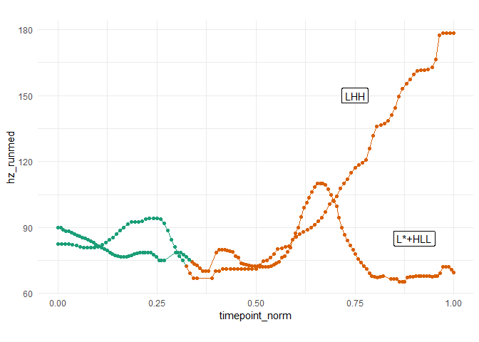

<!-- README.md is generated from README.Rmd. Please edit that file -->

# sosprosody

<!-- badges: start -->

[](https://github.com/tsostarics/sosprosody/actions)
[](https://app.codecov.io/gh/tsostarics/sosprosody?branch=main)

<!-- badges: end -->

This package includes a variety of helper functions involving praat,
textgrids, pitchtiers, and intonation-related data wrangling. This has
been written for my own research, but others may find it helpful as
well. This package extends the `rPraat` package.

## Installation

You can install the development version of `sosprosody` like so:

``` r
library(devtools)
devtools::install_github('tsostarics/sosprosody')
```

## Examples

This package provides `format` and `print` methods for TextGrid and
PitchTier objects loaded with the respective read functions from
`{rPraat}`

``` r
library(rPraat)
library(sosprosody)
pitchtier <- pt.read("grandmother_LHH_003.PitchTier")
textgrid <- tg.read("grandmother_LHH_003.TextGrid")

pitchtier
#> grandmother_LHH_003.PitchTier: 106 total pitch pulses.
#> 181|                                                                           |
#>    |                                                          OOO              |
#>    |                                                      OOOO                 |
#>    |                                                    OO                     |
#>    |                                                 OOO                       |
#>    |                                              OOO                          |
#>    |                                           OOO                             |
#>    |         OOOOOOOOOOOOOOOO            OOOOOO                                |
#>    |                         OOO OOOOOOOO                                      |
#>  58|                            O                                              |
#>    0                                                                         1.6
textgrid
#> grandmother_LHH_003.TextGrid
#> [                words: 4/6 labeled intervals from 0 to 1.6                    ]
#> [                phones: 15/17 labeled intervals from 0 to 1.6                 ]
```

Here’s an example of processing all the textgrids and pitchtiers in a
directory into dataframe representations.

``` r
nuclear_words <- "grandmother"
tg_df <- batch_process_textgrids("./")
#> Processed 2 TextGrids
pt_df <- batch_process_pitchtiers("./")
#> Processed 2 PitchTiers
nuclear_regions <- get_nuclear_textgrids(tg_df, nuclear_words)

str(tg_df)
#> 'data.frame':    30 obs. of  9 variables:
#>  $ file       : chr  "grandmother_LHH_003" "grandmother_LHH_003" "grandmother_LHH_003" "grandmother_LHH_003" ...
#>  $ word_start : num  0.14 0.14 0.14 0.14 0.44 0.5 0.57 0.57 0.57 0.57 ...
#>  $ word_end   : num  0.44 0.44 0.44 0.44 0.5 0.57 1.33 1.33 1.33 1.33 ...
#>  $ word_label : chr  "laura" "laura" "laura" "laura" ...
#>  $ word_i     : int  1 1 1 1 2 3 4 4 4 4 ...
#>  $ phone_start: num  0.14 0.26 0.27 0.39 0.44 0.5 0.57 0.63 0.72 0.84 ...
#>  $ phone_end  : num  0.26 0.27 0.39 0.44 0.5 0.57 0.63 0.72 0.84 0.89 ...
#>  $ phone_label: chr  "l" "ɒ" "ɹ" "ə" ...
#>  $ phone_i    : int  1 2 3 4 5 6 7 8 9 10 ...
#>  - attr(*, "tiertype")= chr "interval"
str(pt_df)
#> 'data.frame':    245 obs. of  6 variables:
#>  $ file               : chr  "grandmother_LHH_003" "grandmother_LHH_003" "grandmother_LHH_003" "grandmother_LHH_003" ...
#>  $ timepoint          : num  0.227 0.237 0.247 0.257 0.267 ...
#>  $ hz                 : num  80.5 82.4 83 82.6 82.3 ...
#>  $ semitone_difference: num  -0.3946 0 0.1251 0.0499 -0.0256 ...
#>  $ semitones_from     : num  82.4 82.4 82.4 82.4 82.4 ...
#>  $ erb                : num  2.49 2.54 2.56 2.55 2.54 ...
```

We can then do some common preprocessing steps, such as coding the
nuclear word in the phrase, applying running median smoothing, and
normalizing the timepoints.

``` r
processed_pt_df <- preprocess_pitchtracks(pt_df,
                                          nuclear_df = nuclear_regions, 
                                          runmed_k = 5,
                                          time_normalize = TRUE,
                                          .fromzero = TRUE)
```

The processed pitch tier data frame can then be plotted like so:

``` r
library(ggplot2)

processed_pt_df |> 
  ggplot(aes(x = timepoint_norm, 
             y = hz_runmed, 
             color = is_nuclear,
             group = file)) +
  geom_point() +
  geom_line() +
  # The rest is just for visuals
  scale_color_brewer(palette = 'Dark2') +
  theme_minimal() +
  coord_fixed(ratio = 1/180) +
  theme(legend.position = 'none') +
  annotate(geom = "label", x = .9, y = 85, label = "L*+HLL") +
  annotate(geom = "label", x = .75, y = 150, label = "LHH")
```


